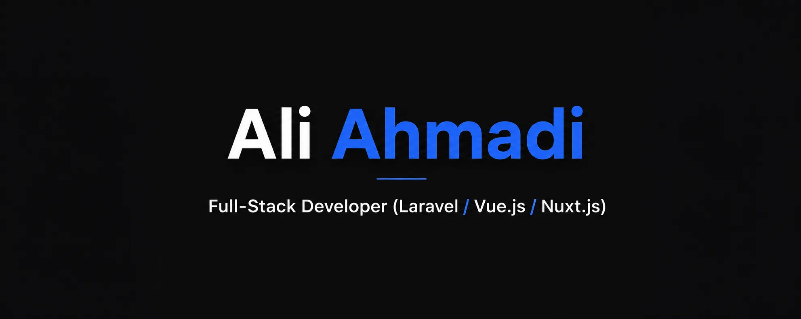

# Hi there 👋, I'm Ali Ahmadi  

Full-Stack Developer with over 8 years of experience in designing, developing, and maintaining scalable web applications using Laravel, Vue.js, Nuxt.js, and WordPress. Experienced in building RESTful APIs, e-commerce platforms, video streaming systems, GIS applications, and online classified platforms. As a Co-Founder and Software Developer at two startups, contributed to software architecture, infrastructure development, and project deployment using Docker, Linux, and Nginx. 

---

## 🚀 Featured Projects

### 🌐 Portfolio

A collection of my featured projects, technical skills, and professional experience in full-stack web development.

🔗 [citydevelopers.ir](https://citydevelopers.ir/portfolio/)

---

## 🚀 Skills & Technologies  

- **Backend:** PHP, Laravel, Livewire, RestFul APIs 
- **Frontend:** Vue.js, Nuxt.js
- **Databases:** MySQL,Redis, SQLite
- **CMS:** WordPress, WooCommerce
- **DevOps:** Docker, Linux, Nginx 
- **Tools:** Git, GitHub

---

## 🛠️ Tech Stack Badges  

---

## 📊 GitHub Stats

---

## 🌐 Languages  

- Persian (Native)  
- English (Able to read and understand technical documentation) 

---

## 📬 Contact Me  

- 📧 Email: [aliahmadicdc@gmail.com](mailto:aliahmadicdc@gmail.com)
- 💼 LinkedIn: [aliahmadicdc](https://www.linkedin.com/in/aliahmadicdc)  
