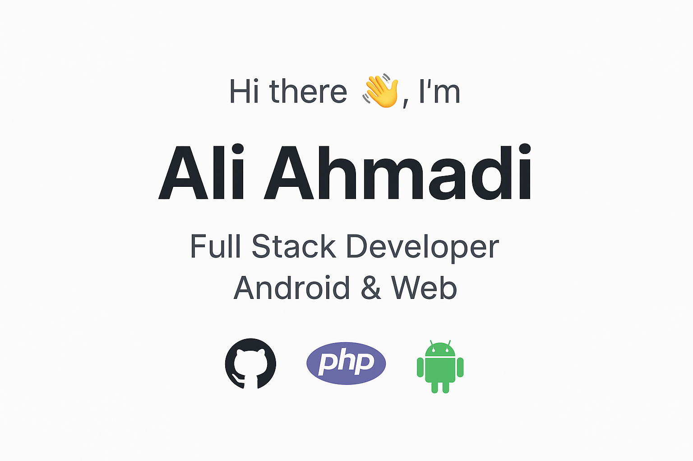

# Hi there 👋, I'm Ali Ahmadi  

I am passionate about programming and always seeking to **learn and grow** in my career.  
I enjoy exploring different technologies and gaining skills, even if only a little, in various fields.  
That is why I am constantly programming or learning new skills.  

---

## 🚀 Skills & Technologies  

- **Backend:** PHP, Laravel, Golang, RestFul API  
- **Frontend:** Vue.js, NuxtJS, JavaScript, TypeScript, HTML, CSS, Bootstrap, Blade, Livewire  
- **Mobile Development:** Kotlin (MVVM), Android  
- **Databases:** MySQL, SQLite, Redis, MongoDB  
- **CMS & Hosting:** WordPress, CPanel, DirectAdmin  
- **Tools & Platforms:** Docker, Git, GitHub  

---

## 🛠️ Tech Stack Badges  

---

## 🌐 Languages  

- Persian (Native)  
- English (Intermediate)  

---

## 📊 GitHub Stats  

  
  

---

## 📬 Contact Me  

- 💼 LinkedIn: [aliahmadicdc](https://www.linkedin.com/in/aliahmadicdc)  
- ✈️ Telegram: [@aliahmadicdc](https://t.me/aliahmadicdc)  

---

⭐️ From [Ali Ahmadi](https://github.com/aliahmadi)  
